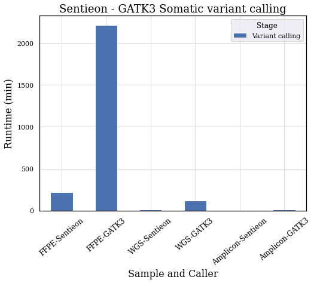
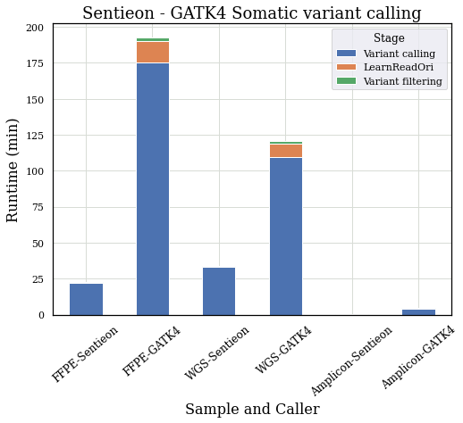

# Matching the results of a GATK somatic pipeline with Sentieon
---

## Introduction

This document describes the capabilities of Sentieon TNseq pipelines matching different versions of GATK somatic variant calling pipelines. If you have any questions, please visit https://www.sentieon.com/support or contact the technical support at Sentieon Inc. at support@sentieon.com.

## Input files
Three somatic samples were processed. (1) Targeted sequencing data obtained from BaseSpace. (2) A formalin-fixed paraffin-embedded (FFPE) sample from the SEQC-II consortium. (3) A paired tumor-normal WGS sample obtained from BaseSpace.

| Sample Type | Sample Source                                                                             | Sample Identifier             | Tumor FASTQ                                                                                                                                                                                       | Normal FASTQ                         |
|-------------|-------------------------------------------------------------------------------------------|-------------------------------|-------------------------------------------------------------------------------------------------------------------------------------------------------------------------------------------------------------|--------------------------------------|
| Amplicon    | BaseSpace Project - NextSeq 550: Comprehensive v3 DNA Panel (Coriell and Horizon Samples) | HD200-10ng-E05C-H01           | HD200-10ng-E05C-H01_S43_L001_R[12]_001.fastq.gz, HD200-10ng-E05C-H01_S43_L001_R[12]_001.fastq.gz, HD200-10ng-E05C-H01_S43_L001_R[12]_001.fastq.gz, HD200-10ng-E05C-H01_S43_L001_R[12]_001.fastq.gz | N/A                                  |
| FFPE        | Sequence Read Archive - SRR7890933 and SRR7890951                                         | FFX_IL_T_24h_1/FFX_IL_N_24h_2 | SRR7890933_[12].fastq.gz                                                                                                                                                                    | SRR7890951_[12].fastq.gz             |
| WGS         | BaseSpace Project - HiSeq 2000: Tumor Normal WGS (HCC1187 & HCC2218)                      | HCC1187                       | HCC1187C_S1_L001_R[12]_001.fastq.gz                                                                                                                                                         | HCC1187BL_S1_L001_R[12]_001.fastq.gz |

## Reference files
The hs37d5 reference genome can be downloaded from ftp://ftp-trace.ncbi.nih.gov/1000genomes/ftp/technical/reference/phase2_reference_assembly_sequence//hs37d5.fa.gz. Other bundle files were downloaded from gs://gatk-best-practices/somatic-b37/.

| Argument | Input file              |
|----------|-------------------------|
| fasta    | hs37d5.fa               |
| germline | small_exac_common_3.vcf |

## Preprocessing
All input fastq files were preprocessed through alignment, duplicate marking and BQSR using the [Sentieon DNAseq pipeline][dnaseq]. BQSR was applied to the aligned reads using the Sentieon ReadWriter for compatibility with the GATK tools.

## Evaluation
The som.py tool from the hap.py package (https://github.com/Illumina/hap.py) was used to compare the Sentieon and GATK VCFs, with the GATK vcf as the "truth" VCF. The following command was used for the comparison:
```sh
python happy/bin/som.py \
  -o output/eval \
  -r $fasta \
  -N \
  $truth_vcf \
  $calls_vcf \
  --no-fixchr-truth \
  --no-fixchr-query
```

# Somatic variant calling
In the commands below, the input alignment files after preprocessing are the `tumor_bam` and `normal_bam` for the tumor and normal preprocessed alignment files, respectively. Arguments and commands used only with the paired normal file are marked with square brackets, `[` and `]`. The GATK commands were parallelized across chromosomes and merged, but the parallelization and merging commands are omitted below for simplicity.

By default, the GATK will downsample reads during variant calling. To reduce the effect of downsampling, MuTect2 in the GATK3 was run with `--maxReadsInRegionPerSample 1000000 --minReadsPerAlignmentStart 1000000 -dt NONE` and Mutect2 in the GATK4 was run with `--max-reads-per-alignment-start 0`. Downsampling arguments are omitted in the command line below.

## TNhaplotyper and MuTect2 version 3.8.1

### Commands

GATK3 variant calling
```sh
java -jar GenomeAnalysisTK.jar \
  -T MuTect2 \
  -R $fasta \
  -I:tumor $tumor_bam \
  [-I:normal $normal_bam] \
  -o output.vcf.gz
```

Sentieon variant calling
```sh
sentieon driver \
  -r $fasta \
  -i $tumor_bam \
  [-i $normal_bam] \
  --algo TNhaplotyper \
  --tumor_sample $tumor_sample \
  [--normal_sample $normal_sample] \
  output.vcf.gz
```

### Results

| Sample Type | Variant Type | Matched | Sentieon Additional | Sentieon Missed | Sensitivity | Precision |
|-------------|--------------|---------|---------------------|-----------------|-------------|-----------|
| Amplicon    | SNVs         | 625     | 0                   | 2               | 0.9968      | 1.0       |
| Amplicon    | INDELs       | 128     | 0                   | 0               | 1.0         | 1.0       |
| FFPE        | SNVs         | 2027    | 0                   | 0               | 1.0         | 1.0       |
| FFPE        | INDELs       | 250     | 0                   | 0               | 1.0         | 1.0       |
| WGS         | SNVs         | 10950   | 0                   | 0               | 1.0         | 1.0       |
| WGS         | INDELs       | 950     | 2                   | 0               | 1.0         | 0.9979    |


### Runtime
Samples were processed on a 32 virtual core Intel Xeon(R) CPU v3 machine
(2.40GHz) with hyperthreading and 64GB memory. The Sentieon tools were
parallelized using their built-in multi-threading while GATK jobs were
parallelized across chromosomes and merged. Due to memory limitations, 8 GATK
jobs were run in parallel.

| Stage            | Sentieon - FFPE | GATK - FFPE | Sentieon - WGS | GATK - WGS | Sentieon - Amplicion | GATK - Amplicon |
|------------------|-----------------|-------------|----------------|------------|----------------------|-----------------|
| Variant calling  | 03:38:07        | 36:56:53    | 00:09:10       | 01:54:48   | 00:00:47             | 00:08:56        |
| Sentieon Speedup | 10.2x           | --          | 12.5x          | --         | 11.4x                | --              |




## TNhaplotyper2 and Mutect2 version 4.1.9.0

### Commands

GATK4 variant calling
```sh
gatk Mutect2 \
  -R $fasta \
  -I $tumor_bam \
  [-I $normal_bam] \
  -tumor $tumor_sample \
  [-normal $normal_sample] \
  --germline-resource $germline \
  -O tmp.vcf.gz \
  --f1r2-tar-gz f1r2.tar.gz

gatk GetPileupSummaries \
  -R $fasta \
  -I $tumor_bam \
  -V $germline \
  -O tumor_pileups.tsv

[gatk GetPileupSummaries \
  -R $fasta \
  -I $normal_bam \
  -V $germline \
  -O normal_pileups.tsv]

gatk LearnReadOrientationModel \
  -I f1r2.tar.gz \
  -O artifact-priors.tar.gz

gatk CalculateContamination \
  -I tumor_pileups.tsv \
  [-I normal_pileups.tsv] \
  -O contamination.table \
  --tumor-segmentation segments.table

gatk FilterMutectCalls \
  -V tmp.vcf.gz \
  -R $fasta \
  -O output.vcf.gz \
  --contamination-table contamination.table \
  --tumor-segmentation segments.table \
  --ob-priors artifact-priors.tar.gz \
  -stats tmp.vcf.gz.stats \
  --filtering-stats output.vcf.gz.stats
```

Sentieon variant calling
```sh
sentieon driver \
  -r $fasta \
  -i $tumor_bam \
  -i $normal_bam \
  --algo TNhaplotyper2 \
    --tumor_sample $tumor_sample \
    [--normal_sample $normal_sample] \
    --germline_vcf $germline \
    tmp.vcf.gz \
  --algo OrientationBias \
    --tumor_sample $tumor_sample \
    tmp.priors \
  --algo ContaminationModel \
    --tumor_sample $tumor_sample \
    [--normal_sample $normal_sample] \
    -v $germline \
    --tumor_segments tmp.segments \
    tmp.contam.table

sentieon driver \
  -r $fasta \
  --algo TNfilter \
  -v tmp.vcf.gz \
  --tumor_sample $tumor_sample \
  [--normal_sample $normal_sample] \
  --contamination tmp.contam.table \
  --tumor_segments tmp.segments \
  --orientation_priors tmp.priors \
  output.vcf.gz
```

### Results
| Sample Type | Variant Type | Matched | Sentieon Additional | Sentieon Missed | Sensitivity | Precision |
|-------------|--------------|---------|---------------------|-----------------|-------------|-----------|
| Amplicon    | SNVs         | 7758    | 24                  | 48              | 0.9939      | 0.9969    |
| Amplicon    | INDELs       | 718     | 5                   | 3               | 0.9958      | 0.9931    |
| Amplicon    | MNPs         | 168     | 0                   | 0               | 1.0         | 1.0       |
| FFPE        | SNVs         | 4322    | 3                   | 31              | 0.9929      | 0.9993    |
| FFPE        | INDELs       | 375     | 0                   | 1               | 0.9973      | 1.0       |
| FFPE        | MNPs         | 191     | 0                   | 2               | 0.9896      | 1.0       |
| WGS         | SNVs         | 11656   | 2                   | 6               | 0.9995      | 0.9998    |
| WGS         | INDELs       | 1299    | 4                   | 1               | 0.9992      | 0.9969    |
| WGS         | MNPs         | 299     | 0                   | 0               | 1.0         | 1.0       |


### Runtime
Samples were processed on a 32 virtual core Intel Xeon(R) CPU v3 machine
(2.40GHz) with hyperthreading and 64GB memory. The Sentieon tools were
parallelized using their built-in multi-threading while GATK Mutect2 jobs were
parallelized across chromosomes and merged. Due to memory limitations, up to 16
GATK jobs were run in parallel. Some GATK tasks were run concurrently, so the
GATK's overall time is less than the sum of the task time.

| Stage              | Sentieon - FFPE | GATK - FFPE | Sentieon - WGS | GATK - WGS | Sentieon - Amplicon | GATK - Amplicon |
|--------------------|-----------------|-------------|----------------|------------|---------------------|-----------------|
| Variant calling    | 00:22:19        | 02:55:32    | 00:33:26       | 01:49:20   | 00:00:23            | 00:03:52        |
| GATK Pileups       | --              | 02:13:29    | --             | 01:34:36   | --                  | 00:01:00        |
| GATK Contamination | --              | 00:00:12    | --             | 00:00:10   | --                  | 00:00:04        |
| GATK LearnReadOri  | --              | 00:14:37    | --             | 00:09:36   | --                  | 00:00:28        |
| Variant filtering  | 00:00:11        | 00:02:33    | 00:00:10       | 00:01:44   | 00:00:04            | 00:00:40        |
| Overall wall time  | 00:22:30        | 03:12:42    | 00:33:36       | 02:00:40   | 00:00:27            | 00:05:00        |
| Sentieon Speedup   | 8.6x            | --          | 3.6x           | --         | 11.1x               | --              |




*GATK4 tasks were run concurrently. The plot only includes the "rate-limiting" GATK4 tasks that sum to the overall wall time.*

[dnaseq]: https://github.com/Sentieon/sentieon-dnaseq
